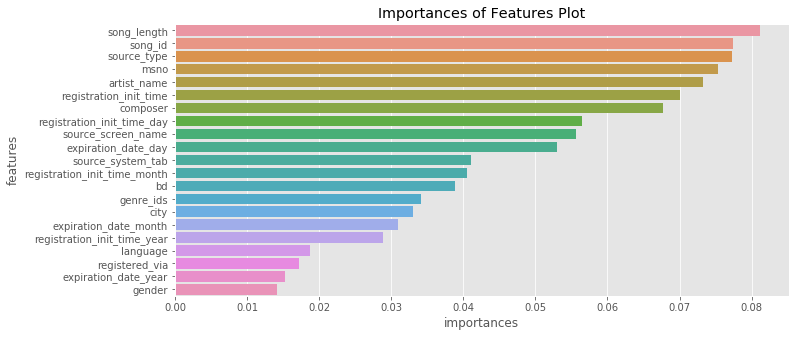

# Machine Learning Engineer Nanodegree
## Capstone Project
Manish Kumar
September 21th, 2019

## I. Definition

### Project Overview
The commercialisation of the Internet and its entry into daily life along with the switch from analog to digital and the invention of the personal computer were the beginnings of the digital and technological changes that are now seen particularly within the music industry in the 21st century.  
Few years ago, it was inconceivable that a person would listen to the Various Artists of choice on their morning commute. But, the glory days of Radio DJs have passed, and musical gatekeepers have been replaced with Machine Learning algorithms, continously finding and curating new tracks and unlimited streaming services.  
While an OTT music subscriber has access to all kinds of music, algorithms still struggle in some areas. Without enough data about listening patter of the user, how would an algorithm know if the listener will like a new song or a new artist And, how would it know what songs to recommend to a new user. 
Music being an 18 Billion Dollars industry, is growing as more free subscribers are converting to a paid user for the convenience of auto music curation.  

### Problem Statement
In this regard; at the 11th ACM International Conference on Web Search and Data Mining ([WSDM 2018](http://www.wsdm-conference.org/2018/)) presented a [Kaggle Challenge](https://www.kaggle.com/c/kkbox-music-recommendation-challenge/overview) to build a better music recommendation system using a donated dataset from [KKBOX](https://www.kkbox.com/), Asia’s leading music streaming service, holding the world’s most comprehensive Asia-Pop music library with over 30 million tracks.  
[KKBOX](https://www.kkbox.com/) uses a collaborative filtering based algorithm with matrix factorization and word embedding in their recommendation system but believe new techniques could lead to better results.  
In this project, I will try to predict the chances of a user listening to a song repetitively after the first observable listening event within a time window was triggered.  
If there are recurring listening event(s) triggered within a month after the user’s very first observable listening event, its target is marked 1, and 0 otherwise in the training set. The same rule applies to the testing set.  

### Metrics
In Machine Learning, performance measurement is an essential task. So when it comes to a classification problem, we can count on an AUC Curve. When we need to check or visualize the performance of the multi - class classification problem, we use AUC (Area Under The Curve) ROC (Receiver Operating Characteristics) curve. It is one of the most important evaluation metrics for checking any classification model’s performance. Higher the AUC Value, better the model is at predicting 0s as 0s and 1s as 1s. In this case, Higher the AUC, better the model is at distinguishing between repeatability of a song.

  

   

  
  

An excellent model has AUC near to the 1 which means it has good measure of separability. A poor model has AUC near to the 0 which means it has worst measure of separability. In fact it means it is reciprocating the result. It is predicting 0s as 1s and 1s as 0s. And when AUC is 0.5, it means model has no class separation capacity whatsoever.
  

## II. Analysis

### Data Exploration
From [KKBOX](https://www.kkbox.com/) we have training data set consisting of information of the first observable listening event for each unique user-song pair within a specific time duration. Metadata of each unique user and song pair is also provided.  
The train and the test data are selected from users listening history in a given time period. The train and test sets are split based on time, and the split of public/private are based on unique user/song pairs.  
Number of Unique Songs in Training Dataset: 359966  
Number of Unique Songs in Testing Dataset: 224753  

Number of Unique Users in Training Dataset: 30755  
Number of Unique Users in Testing Dataset: 25131  

Number of Unique Artists in Training Dataset: 40582  
Number of Unique Artists in Testing Dataset: 27563 
 
Number of Languages in the Training and Testing Dataset: 10  
Number of Genres in Training Dataset: 572  
Number of Genres in Training Dataset: 501   

The Dataset has been taken from the [WSDM - KKBox's Music Recommendation Challenge](https://www.kaggle.com/c/kkbox-music-recommendation-challenge/overview) 

  

### Exploratory Visualization
As part of exploratory data analysis(EDA) to see what data can reveal beyond the formal modelling, following plots were obtained. This exploration was done using the [Data Exploration Notebook](https://github.com/m4ni5h/UdacityMLND2/blob/master/CapstoneProject/Project/1_DataExploration.ipynb) checked in the GitHub Repository.

Plotting Number of Plays VS Repeatability:

  

Plotting Genre,Composer,Lyricist Verses Repeatability of the Song:

  

<!-- Plotting Language,Songs,Plays Verses Repeatability of the Song:

  

 -->
Plotting Count Verses Duration of the Song:

  

Plotting Count Verses Repeatability of the Song:

  

Plotting Count Verses Number of Plays of the Song:

  

   
Plotting Artists Verses Number of Plays of the Song:

  

<!-- Plotting Artists Verses Repeatability of the Song:

  

 -->

Plotting Repeatability Verses Number of Plays of the Song:

  

<!-- Plotting Artists Verses Languages of the Song:

  

 -->

<!-- Plotting Tracks,Plays,Repeatability Verses Language of the Song:

  

 -->

Plotting Track,Plays,Repeatability Verses Genre of the Song:

  

Plotting Plays Verses Genre of the Song:

  

### Algorithms and Techniques
The Algorithms that I intend to use in this project is XGBOOST and CNN.
XGBoost is an optimized distributed gradient boosting library designed to be highly efficient, flexible and portable. It implements machine learning algorithms under the Gradient Boosting framework. XGBoost provides a parallel tree boosting (also known as GBDT, GBM) that solve many data science problems in a fast and accurate way. XGBoost is an algorithm that has recently been dominating applied machine learning and Kaggle competitions for structured or tabular data. XGBoost is an implementation of gradient boosted decision trees designed for speed and performance. The implementation of the algorithm was engineered for efficiency of compute time and memory resources. In my case of predicting the Repeatability of the song, I will use this Algorithm to compute precision value.
CNN (Convolutional neural networks) are comprised of two very simple elements, namely convolutional layers and pooling layers. Although simple, there are near-infinite ways to arrange these layers for a given problem. Fortunately, there are both common patterns for configuring these layers and architectural innovations that can be used to develop very deep convolutional neural networks. Studying these architectural design decisions developed for state-of-the-art classification tasks can provide both clarity and intuition for how to use these designs when designing a deep convolutional neural network model.

### Benchmark
To create a Benchmark model as mentioned above, I would be using XGBOOST algorithm.  
The notebook used for this can be accessed [here](https://github.com/m4ni5h/UdacityMLND2/blob/master/CapstoneProject/Project/2_XGBOOST.ipynb). 
It starts with some data Preparation:
- Replacing NAs
- Merging Datasets(train, songs, members)
- Creating new features (registration_init_time_days, registration_init_time_months, registration_init_time_years and expiration_date)
- Dropping correlated columns.  
Finding CoRelation between the features

  

Feature Importance

  

Dropping the less important columns(< 0.04).
   
Then using a XGBOOST Classifier with following parameters:
XGBClassifier(base_score=0.5, booster='gbtree', colsample_bylevel=1,
              colsample_bynode=1, colsample_bytree=1, gamma=0,
              learning_rate=0.1, max_delta_step=0, max_depth=15,
              min_child_weight=5, missing=None, n_estimators=300, n_jobs=1,
              nthread=None, objective='binary:logistic', random_state=0,
              reg_alpha=0, reg_lambda=1, scale_pos_weight=1, seed=None,
              silent=None, subsample=1, verbosity=1)
              
## III. Methodology

### Data Preprocessing
Data preprocessing is a data mining technique that involves transforming raw data into an understandable format. Real-world data is often incomplete, inconsistent, and/or lacking in certain behaviors or trends, and is likely to contain many errors. Data preprocessing is a proven method of resolving such issues. Data preprocessing prepares raw data for further processing.
In my case, data obtained from [WSDM - KKBox's Music Recommendation Challenge](https://www.kaggle.com/c/kkbox-music-recommendation-challenge/overview) required some Data Processing as it was a direct dump from the KKBox database.
I followed following processing steps to make the data suitable for the CNN that I plan to use in the next steps.
- Processing the IDs:
  - Removing the Songs IDs from Songs and song_extra_info that do not appear training, testing Dataset.
  - Applying sklearn.preprocessing.LabelEncoder on MSNO and song_id.
  - Handling Empty values and Applying LabelEncoder on Train, Test and Members Dataset.
  - Handling the Genre information in Songs dataset by IDing the genres.
  - Creating artist_cnt, lyricist_cnt, composer_cnt and is_featured in Songs Dataset.
  - Handling the empty artist_name, lyricist, composer and language and Applying LabelEncoder.
- Processing the Occurances of data:
  - Finding the count of songs wrt to user.
  - Finding the count of songs wrt to artists, composers, lyricists and genres.
  - Finding the count of songs wrt to the source on which song was played.
- Processing the ISRC(International Standard Recording Code)
  - Handling the missing ISRCs: 
  - Finding count of songs as per Country Code, Registrant Code, Year of Reference and Designation Code
  - Finding count of Listens as per Country Code, Registrant Code, Year of Reference and Designation Code
- Applying SVD:
  - SVD on User-Songs Pairs
  - SVD on User-Artist Pairs
- Feature engineer the time stamp for some features.
- Compiling data before and after process.
- Making the data ready for Training.

### Implementation
In this section, the process for which metrics, algorithms, and techniques that you implemented for the given data will need to be clearly documented. It should be abundantly clear how the implementation was carried out, and discussion should be made regarding any complications that occurred during this process. Questions to ask yourself when writing this section:
- _Is it made clear how the algorithms and techniques were implemented with the given datasets or input data?_
- _Were there any complications with the original metrics or techniques that required changing prior to acquiring a solution?_
- _Was there any part of the coding process (e.g., writing complicated functions) that should be documented?_
Implementation was done using code which is checked in [GitHub](https://github.com/m4ni5h/UdacityMLND2/tree/master/CapstoneProject/Project).
The main code is part of nn_training.py which is split into four parts:
- Data Loading
- Feature Preparation
- Model Structure
- Model Training
As mentioned in the Algorithm part of the document that there are near-infinite ways to arrange these layers for a given problem, I too tried various structure with different hyper-parameters. The structure of the NN I chose to go with is:

  

List of Hyper-parameters are part of nn_record.csv file. 
For modelling I had to try various parameters till I came to a conclusion, then I chose to deliberatly make the hyperparameters part of an input csv to facilitate a comparative study on the hyperparameter to choose in case we are deploying the Neural Network.
I have tried to document code where ever possible for clarity in understading.
During this project it dawn to me that we have used cleaned and archived data in our lessons; it took a lot of time and learning to get the Feature engineering part of the project done. Feature engineering is a part which I saw makes a lot of difference when it comes to accuracy and time of execution. Dimensionality reduction where ever required is also important using techniques like SVD. Some problem solvers on Kaggle just are able to beat other participants by using better Feature Engineering methods.

### Refinement
With BenchMark model, I was able to get an accuracy of 70%, when I first started to port the solution to Neural Network, I was not able to beat the benchmark model; As I had not done any Feature Engineering on the Provided Dataset. Also, the parameters were not correctly tuned. I also employed various techniques like:
- Dynamic learning rate: whenever the loss function stopped decreasing, a learning rate drop was added.
- Weight decay: when overfitting was detected (the training and validation losses diverged too much), the weight decay rate was increased
   
The final TensorFlow model was derived by training in an iterative fashion, adjusting the parameters (e.g. learning rate, weight decay ratios). The final model has an accuracy of 73%.

## IV. Results

### Model Evaluation and Validation
The val_auc value of the model is used to evaluated the model. Also, the final architecture has been chosen because of its preformance which was tested by manipulating the structure. 
 
The different hyper parameters are part of nn_record.csv:
time,mode,activation,batchnorm,K,K0,lw,lw1,lr,lr_decay,sample_weight_rate,bst_epoch,trn_loss,trn_acc,val_loss,val_auc
2019-09-20 13:31:35,nn_dot,elu,False,74,11,0.0005315258,0,0.001405365,0.778385,0,26,0.5288,0.73833,0.59692,0.73192
2019-09-20 12:56:21,nn_dot,elu,True,82,6,0.0003233625,0,0.008507431,0.903615,0,19,0.54008,0.72931,0.60167,0.72858
2019-09-20 17:07:30,nn_dot,leakyrelu,True,88,7,0.0009984157,0,0.0125347,0.909158,0,35,0.51591,0.74253,0.60994,0.72832
2019-09-20 13:52:48,nn_dot,tanh,True,106,10,0.001520053,0,0.008778001,0.916829,0,38,0.52024,0.74107,0.59652,0.72796
2019-09-20 14:10:16,nn_dot,tanh,True,51,15,0.0008714193,0,0.01027691,0.769936,0,21,0.5345,0.72838,0.59239,0.72767

The different Model Structure obtained for the different hyper-parameters are available [here](https://github.com/m4ni5h/UdacityMLND2/tree/master/CapstoneProject/Project/images/NNStructure)
As part of checking the robustness of the model, I had executed the same model by splitting the into halfs and one forth, but still I was able to achieve AUC > 0.71.

### Justification
As noted above I chose to use XGBOOST for its speed and efficiency as benchmark model.

  

  

 
With this I was able to get accuracy of 0.69:

  

 
There is no comparison between the time the two algorithms took for training, as XGBOOST outperformed the NN exponentially. But as far as the accuracy of the two models are concerned, the NN model performed better than the XGBOOST and the same can be further tuned to make the accuracy better.

## V. Conclusion

### Free-Form Visualization
As mentioned in the Model Evaluation and Validation, I had split the data from [WSDM - KKBox's Music Recommendation Challenge](https://www.kaggle.com/c/kkbox-music-recommendation-challenge/overview) and I ran the same model on the data, it produced an AUC of 0.74, Which can be seen in the nn_record_free_form.csv
The different AUC values can be seen in the val_auc column part of nn_record_free_form.csv:
time,mode,activation,batchnorm,K,K0,lw,lw1,lr,lr_decay,sample_weight_rate,bst_epoch,trn_loss,trn_acc,val_loss,val_auc
2019-09-21 14:50:30,nn_dot,elu,False,74,11,0.0005315258,0,0.001405365,0.778385,0,26,0.5288,0.73833,0.59692,0.73232
2019-09-21 13:59:23,nn_dot,elu,True,82,6,0.0003233625,0,0.008507431,0.903615,0,19,0.54008,0.72931,0.60167,0.76754
2019-09-21 18:19:55,nn_dot,leakyrelu,True,88,7,0.0009984157,0,0.0125347,0.909158,0,35,0.51591,0.74253,0.60994,0.72856
2019-09-21 14:59:03,nn_dot,tanh,True,106,10,0.001520053,0,0.008778001,0.916829,0,38,0.52024,0.74107,0.59652,0.72678
2019-09-21 15:14:19,nn_dot,tanh,True,51,15,0.0008714193,0,0.01027691,0.769936,0,21,0.5345,0.72838,0.59239,0.72893

### Reflection
Reflecting on the process that I followed for completing the project can be put in following process:
  - Load Datasets from CSV.
  - Understand Data With Descriptive Statistics. (Analyze Data)
  - Understand Data With Visualization. (Analyze Data)
  - Pre-Process Data. (Prepare Data)
  - Feature Selection. (Prepare Data)
  - Resampling Methods. (Evaluate Algorithms)
  - Algorithm Evaluation Metrics. (Evaluate Algorithms)
  - Model Selection. (Evaluate Algorithms)
  - Pipelines. (Evaluate Algorithms)
  - Algorithm Parameter Tuning. (Improve Results)
  - Model Finalization. (Present Results)  

Actually the steps are part of top level tasks which can be defined as Define Problem, Analyze Data, Prepare Data, Evaluate Algorithms, Improve Results and Present Results
From the course, I had enough practise in most of the steps but Feature selection, Resampling Method thinking about Pipeline were challenging in the sense that I did not consider them to take so much time. With this project I came to know their importance on the Final result too. As I had metioned that in competitions like Kaggle, Feature engineering becomes very important.

### Improvement
Now that the project is near completion, It became clear that Neural Network solutions are complex and require a lot of resource, very easily I was able to reach the maximum limit of the RAM(18GB) of my development setup, then I had to divide the data in chunks to solve to the problem at hand. In this scenario, AMAZON Sagemaker could have been choosen for solving the problem.
It also became clear that given the limited resource and time, Machine Learning algorithms like XGBOOST and Light GBM are still prevalent among ML engineers even for competitive problems. 
As this field is still evolving there would be better solution to any problem that we are trying to solve today. Also, I have still not explored fully the latest Algorithms that have come out which are more efficient and accurate. 

------------
