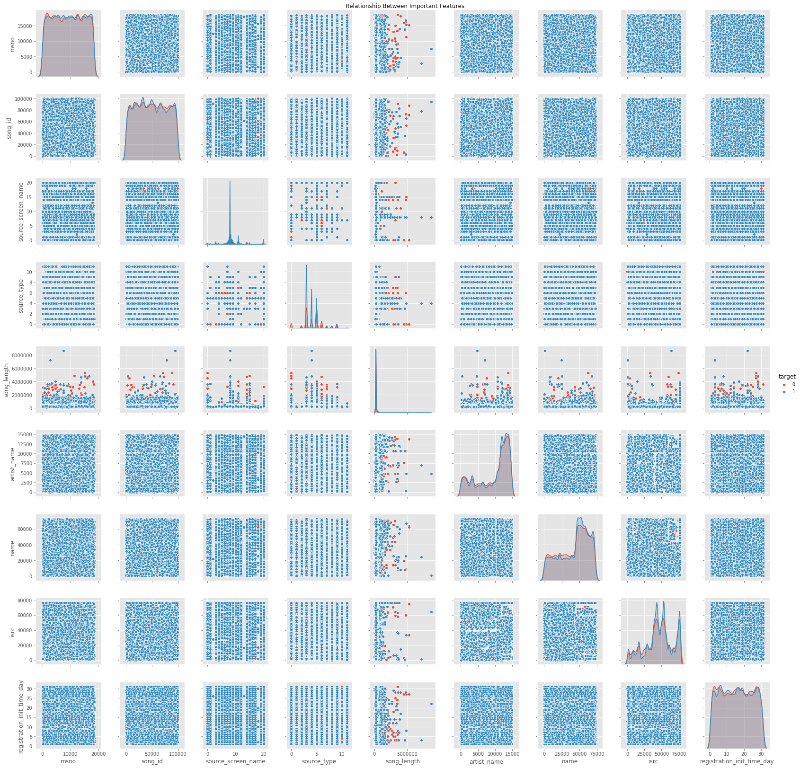
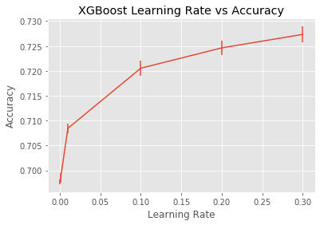
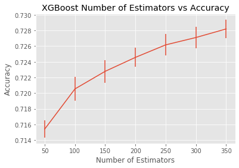
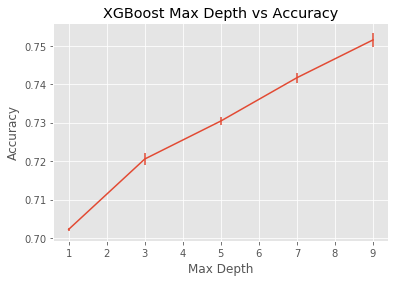
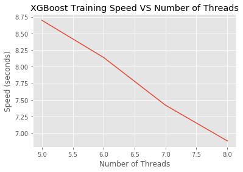

# Machine Learning Engineer Nanodegree
## Capstone Project
Joe Udacity  
December 31st, 2050

## I. Definition

### Project Overview
The commercialisation of the Internet and its entry into daily life along with the switch from analog to digital and the invention of the personal computer were the beginnings of the digital and technological changes that are now seen particularly within the music industry in the 21st century.  
Few years ago, it was inconceivable that a person would listen to the Various Artists of choice on their morning commute. But, the glory days of Radio DJs have passed, and musical gatekeepers have been replaced with Machine Learning algorithms, continously finding and curating new tracks and unlimited streaming services.  
While an OTT music subscriber has access to all kinds of music, algorithms still struggle in some areas. Without enough data about listening patter of the user, how would an algorithm know if the listener will like a new song or a new artist And, how would it know what songs to recommend to a new user. 
Music being an 18 Billion Dollars industry, is growing as more free subscribers are converting to a paid user for the convenience of auto music curation.  

### Problem Statement
In this regard; at the 11th ACM International Conference on Web Search and Data Mining ([WSDM 2018](http://www.wsdm-conference.org/2018/)) presented a [Kaggle Challenge](https://www.kaggle.com/c/kkbox-music-recommendation-challenge/overview) to build a better music recommendation system using a donated dataset from [KKBOX](https://www.kkbox.com/), Asia’s leading music streaming service, holding the world’s most comprehensive Asia-Pop music library with over 30 million tracks.  
[KKBOX](https://www.kkbox.com/) uses a collaborative filtering based algorithm with matrix factorization and word embedding in their recommendation system but believe new techniques could lead to better results.  
In this project, I will try to predict the chances of a user listening to a song repetitively after the first observable listening event within a time window was triggered.  
If there are recurring listening event(s) triggered within a month after the user’s very first observable listening event, its target is marked 1, and 0 otherwise in the training set. The same rule applies to the testing set.  

### Metrics
I would be using [Accuracy_Score](https://scikit-learn.org/stable/modules/generated/sklearn.metrics.accuracy_score.html) which is part of SciKit Library to measure the performance of the model. As mentioned in the [SCIKIT knowledge base](https://scikit-learn.org/stable/modules/model_evaluation.html#accuracy-score), accuracy score can be used in multi-label or single-label classification. Our case is single label classification problem i.e. target value, which indicates the probability of replaying the song.

  

--- 
references:
- http://www.wsdm-conference.org/2018
- https://www.kaggle.com/c/kkbox-music-recommendation-challenge/overview
- https://www.kkbox.com
- https://scikit-learn.org/stable/modules/model_evaluation.html#accuracy-score
- https://scikit-learn.org/stable/modules/generated/sklearn.metrics.accuracy_score.html
---

## II. Analysis

### Data Exploration
The Dataset has been taken from the [WSDM - KKBox's Music Recommendation Challenge](https://www.kaggle.com/c/kkbox-music-recommendation-challenge/overview).
From [KKBOX](https://www.kkbox.com/) we have training data set consisting of information of the first observable listening event for each unique user-song pair within a specific time duration. Metadata of each unique user and song pair is also provided.  
The train and the test data are selected from users listening history in a given time period. The train and test sets are split based on time, and the split of public/private are based on unique user/song pairs. 

- train.csv
    - msno: user id
    - song_id: song id
    - source_system_tab: the name of the tab where the song was played.
    - source_screen_name: name of the layout a user sees.
    - source_type: an entry point a user first plays music on mobile apps. An entry point could be album, online-playlist, song .. etc.
    - target: this is the target variable. target=1 means there are recurring listening event(s) triggered within a month after the user’s very first observable listening event, target=0 otherwise.
- test.csv
    - id: row id
    - msno: user id
    - song_id: song id
    - source_system_tab: the name of the tab where the song was played.
    - source_screen_name: name of the layout a user sees.
    - source_type: an entry point a user first plays music on mobile apps. An entry point could be album, online-playlist, song .. etc.
- songs.csv
    - song_id
    - song_length: in ms
    - genre_ids: genre category
    - artist_name
    - composer
    - lyricist
    - language
- members.csv
    - msno
    - city
    - bd: age
    - gender
    - registered_via: registration method
    - registration_init_time: format %Y%m%d
    - expiration_date: format %Y%m%d
- song_extra_info.csv
    - song_id
    - song name - the name of the song.
    - isrc (International Standard Recording Code)

Unique Songs in Training Dataset: 359966  
Unique Songs in Testing Dataset: 224753  
Unique Users in Training Dataset: 30755  
Unique Users in Testing Dataset: 25131  
Unique Artists in Training Dataset: 40582  
Unique Artists in Testing Dataset: 27563 
Languages in the Training and Testing Dataset: 10  
Genres in Training Dataset: 572  
Genres in Training Dataset: 501   

The categorical features present in the Dataset: msno, song_id, source_system_tab, source_screen_name, source_type, genre_ids, artist_name, composer, lyricist, gender, name, isrc.  
Also, some features had Null values which had to be handled.

### Exploratory Visualization
The dataset shared by [KKBOX](https://www.kkbox.com/) has five files  members.csv, song_extra_info.csv, songs.csv, test.csv and train.csv. It can be seen in the notebook that the final training set is created by merging data from members.csv, song_extra_info.csv, songs.csv and train.csv. This merge operation resulted to 20 features, further breaking down the two time features (registration_init_time and expiration_date) into year, month and date, resulted to a total of 24 features after removing the two previous time features because of duplicity. To see relationship between 24 features was a big task, so I employed [Feature_Importance](https://scikit-learn.org/stable/modules/generated/sklearn.ensemble.RandomForestClassifier.html#sklearn.ensemble.RandomForestClassifier.feature_importances_) present in [Ensemble_RandomForestClassifier](https://scikit-learn.org/stable/modules/generated/sklearn.ensemble.RandomForestClassifier.html#sklearn.ensemble.RandomForestClassifier) to deduce Important Features and then created a PairPlot of Important Features to understand the relationship between the features.  

  

  

Another analysis to better understand the correlation between the features is by generating a heatmap of feature correlation.

  

### Algorithms and Techniques
For solving the chosen classification problem where we want to find if a music subscriber will re-play a song within a month or not, I intend to use ensemble technique where I will first see the performance of different Models like:
- [KNeighborsClassifier](https://scikit-learn.org/stable/modules/generated/sklearn.neighbors.KNeighborsClassifier.html)
- [DecisionTreeClassifier](https://scikit-learn.org/stable/modules/generated/sklearn.tree.DecisionTreeClassifier.html)
- [RandomForestClassifier](https://scikit-learn.org/stable/modules/generated/sklearn.ensemble.RandomForestClassifier.html)
- [AdaBoostClassifier](https://scikit-learn.org/stable/modules/generated/sklearn.ensemble.AdaBoostClassifier.html)
- [GradientBoostingClassifier](https://scikit-learn.org/stable/modules/generated/sklearn.ensemble.GradientBoostingClassifier.html)
- [GaussianNB](https://scikit-learn.org/stable/modules/generated/sklearn.naive_bayes.GaussianNB.html)
- [LinearDiscriminantAnalysis](https://scikit-learn.org/stable/modules/generated/sklearn.discriminant_analysis.LinearDiscriminantAnalysis.html) and
- [QuadraticDiscriminantAnalysis](https://scikit-learn.org/stable/modules/generated/sklearn.discriminant_analysis.QuadraticDiscriminantAnalysis.html) 

Then finally using [StackingCVClassifier](http://rasbt.github.io/mlxtend/user_guide/classifier/StackingCVClassifier) technique to stack few selected classifiers to get better results. The resulting ensemble model will serve as my Benchmark model.
For the final solution I intend to use the better performing model among [LightGBM](https://lightgbm.readthedocs.io/en/latest/) and [XGBOOST](https://xgboost.readthedocs.io/en/latest/).

### Benchmark
As mentioned above, I choose to use [StackingCVClassifier](http://rasbt.github.io/mlxtend/user_guide/classifier/StackingCVClassifier/) to stack basic models which perform better on the dataset.
From the analysis done, which can be accessed in the accompanying Jupyter notebook, its seen that [GradientBoostingClassifier](https://scikit-learn.org/stable/modules/generated/sklearn.ensemble.GradientBoostingClassifier.html) and [RandomForestClassifier](https://scikit-learn.org/stable/modules/generated/sklearn.ensemble.RandomForestClassifier.html) perform better than the other listed models. The two models gave an [accuracy](https://scikit-learn.org/stable/modules/generated/sklearn.metrics.accuracy_score.html) of 0.72 and 0.74 respectively when trained on the data.

--- 
references:
- https://scikit-learn.org/stable/modules/generated/sklearn.neighbors.KNeighborsClassifier.html
- https://scikit-learn.org/stable/modules/generated/sklearn.tree.DecisionTreeClassifier.html
- https://scikit-learn.org/stable/modules/generated/sklearn.ensemble.RandomForestClassifier.html
- https://scikit-learn.org/stable/modules/generated/sklearn.ensemble.AdaBoostClassifier.html
- https://scikit-learn.org/stable/modules/generated/sklearn.ensemble.GradientBoostingClassifier.html
- https://scikit-learn.org/stable/modules/generated/sklearn.naive_bayes.GaussianNB.html
- https://scikit-learn.org/stable/modules/generated/sklearn.discriminant_analysis.LinearDiscriminantAnalysis.html
- https://scikit-learn.org/stable/modules/generated/sklearn.discriminant_analysis.QuadraticDiscriminantAnalysis.html
- http://rasbt.github.io/mlxtend/user_guide/classifier/StackingCVClassifier
- https://lightgbm.readthedocs.io/en/latest
- https://xgboost.readthedocs.io/en/latest/
---

## III. Methodology

### Data Preprocessing
To prepare the final training set from the data obtained from the [WSDM - KKBox's Music Recommendation Challenge](https://www.kaggle.com/c/kkbox-music-recommendation-challenge/overview) following steps were taken:
- Loading the training data from train.csv
- Merging the training data with songs data(songs.csv) on matching song_id.
- Merging the resultant data from previous step with members data(members.csv) on matching msno.
- Merging the resultant data from previous step with extra songs information(song_extra_info.csv) on matching song_id.
- The resulting dataset had null values in following features: 
  - source_system_tab
  - source_screen_name
  - source_type
  - genre_ids
  - artist_name
  - composer
  - lyricist
  - language
  - gender
  - name
  - isrc
- The training set also had two datetime features; registration_init_time and expiration_date, these features were broken into year, month and day.
- As, the training dataset had few categorical features (msno, song_id, source_system_tab, source_screen_name, source_type, genre_ids, artist_name, composer, lyricist, gender, name, isrc) these features had to be Encoded using [LabelEncoder](https://scikit-learn.org/stable/modules/generated/sklearn.preprocessing.LabelEncoder.html)

With this our training data is ready for the implementation part.

### Implementation
In the evolving field of machine learning there are a lot of Algorithms which we encounter, but recently some algorithms are more prevalently used because of their efficiency and accuracy. This can be verified from articles published in ML community, where the coders are employing new ML algorithms like [LightGBM](https://lightgbm.readthedocs.io/en/latest/) and [XGBOOST](https://xgboost.readthedocs.io/en/latest/) in their attempts to solve ML Problems. In this project, I am attempting to test the well known classic ML algorithms mentioned in the Algorithms and Techniques section, even creating an ensemble of the better performing Models and then beating this ensemble model with newer Models.

The implementation can be seen in the accompanying Jupyter notebook where the accuracy of the classic models are as follows:
- KNeighborsClassifier: 0.618
- DecisionTreeClassifier: 0.697
- RandomForestClassifier: 0.746
- AdaBoostClassifier: 0.714
- GradientBoostingClassifier: 0.721
- GaussianNB: 0.665
- LinearDiscriminantAnalysis: 0.673
- QuadraticDiscriminantAnalysis: 0.680

Its seen that RandomForestClassifier and GradientBoostingClassifier perform better than the rest of the Models in the list. Thus I created an ensemble of the two Models using [StackingCVClassifier](http://rasbt.github.io/mlxtend/user_guide/classifier/StackingCVClassifier/) which resulted in an overall accuracy of 0.73

For the final model I experimented with the [LightGBM](https://lightgbm.readthedocs.io/en/latest/) and [XGBOOST](https://xgboost.readthedocs.io/en/latest/) model, which gave following accuracy values:
0.736 and 0.761 respectively

### Refinement
For refining the final solution which is [XGBOOST](https://xgboost.readthedocs.io/en/latest/) I had to understand the parameters defined in [XGBOOST_Docs](https://xgboost.readthedocs.io/en/latest/python/python_api.html#xgboost.XGBClassifier). The main parameters which I chose for tuning in this case was learning_rate, n_estimators, max_depth and n_jobs. The process that was employed for tuning is [GridSearchCV](https://scikit-learn.org/stable/modules/generated/sklearn.model_selection.GridSearchCV.html), and the chosen scoring parameter is '[accuracy]'(https://scikit-learn.org/stable/modules/generated/sklearn.metrics.accuracy_score.html). Also, as XGBOOST supports early stopping I used it in case our model reaches inflection point. 
Following graphs were obtained when trying to find out the tuned values for the above mentioned hyper parameters(implementation in the accompanying Jupyter Notebook).

  

  

  

  

---
references:
- https://scikit-learn.org/stable/modules/generated/sklearn.preprocessing.LabelEncoder.html
- https://lightgbm.readthedocs.io/en/latest/
- https://xgboost.readthedocs.io/en/latest/
- http://rasbt.github.io/mlxtend/user_guide/classifier/StackingCVClassifier/
- https://scikit-learn.org/stable/modules/generated/sklearn.model_selection.GridSearchCV.html
- https://machinelearningmastery.com/xgboost-with-python/
---

## IV. Results

### Model Evaluation and Validation
The final XGBClassifier model is chosen with following hyperparameters (implementation in the accompanying Jupyter notebook):
- learning_rate(chosen value = 0.3)
  - A problem with gradient boosted decision trees is that they are quick to learn and overfit training data. One effective way to slow down learning in the gradient boosting model is to use a learning rate, from the study on the relationship between accuracy and the learning rate in [Refinement](#Refinement) where accuracy value was calculated for learning rates 0.0001, 0.001, 0.01, 0.1, 0.2 and 0.3, the accuracy value seems to not vary much after 0.3, which led to choosing this value.
- n_estimators(chosen value = 300)
  - Gradient boosting involves the creation and addition of decision trees sequentialy, each attempting to correct the mistakes of the learners that came before it. This raises the question as to how many trees (estimators) to configure in your gradient boosting model. From the study on the relationship between accuracy and number of Estimators used by the model in [Refinement](#Refinement), I tried finding accuracy value for number of estimators 50, 100, 150, 200, 250, 300 and 350
- max_depth(chosen value = 20)
  - This parameter lets us choose the size of the decision trees, Shallow trees are expected to have poor performance as they capture few details and if we choose too deeper trees they capture too many details and overfit the training dataset. From the study on the relationship between accuracy and the max depth parameter used by the model in [Refinement](#Refinement), I tried finding accuracy value for maximum depth values 12, 14, 16, 18 and 20.
- n_jobs(chosen value = 8)
  - The XGBoost library for gradient boosting is designed for efficient multi-core parallel processing. This allows it to efficiently use all of the CPU cores in our system when training. From the analysis on the relationship between training speed and number of threads used by the model for training in [Refinement](#Refinement), we can see a decrease in training time as number of threads increase.

The values were obtained keeping the accuracy of the model as the scoring parameter in [sklearn.model_selection.GridSearchCV](https://scikit-learn.org/stable/modules/generated/sklearn.model_selection.GridSearchCV.html).

For the sensitivity analysis of the model and its Original training data obtained from the [WSDM - KKBox's Music Recommendation Challenge](https://www.kaggle.com/c/kkbox-music-recommendation-challenge/overview) had train.csv of size 971.7MB, this was split into 5 csv files of 200MB. Keeping all other input files and validation dataset same, I was able to get the an accuracy of 0.7572, 0.7622, 0.7101, 0.7781 and 0.7434 from the final refined XGBOOST model.

### Justification
The benchmark model for this project is the ensembled/stacked model of two better performing models from the classic ML model list:
- KNeighborsClassifier: 0.618
- DecisionTreeClassifier: 0.697
- RandomForestClassifier: 0.746
- AdaBoostClassifier: 0.714
- GradientBoostingClassifier: 0.721
- GaussianNB: 0.665
- LinearDiscriminantAnalysis: 0.673
- QuadraticDiscriminantAnalysis: 0.680  
The ensemble of the two Models([GradientBoostingClassifier](https://scikit-learn.org/stable/modules/generated/sklearn.ensemble.GradientBoostingClassifier.html) and [RandomForestClassifier](https://scikit-learn.org/stable/modules/generated/sklearn.ensemble.RandomForestClassifier.html)) using [StackingCVClassifier](http://rasbt.github.io/mlxtend/user_guide/classifier/StackingCVClassifier/) resulted in an overall accuracy of 0.73

With the Final Model based on XGBOOST, a Gradient boosting algorithm, the 0.73 benchmark was easily achieved(0.747) without any tuning by using the default parameters. Moreover, after tuning the parameters for the problem at hand the final model was able to give a consistant accuracy value more than 0.75, even when trying on different training samples. So this proves that the final solution is significant enough to solve the problem.  

---
references:
- https://scikit-learn.org/stable/modules/generated/sklearn.model_selection.GridSearchCV.html
- https://www.kaggle.com/c/kkbox-music-recommendation-challenge/overview
- https://scikit-learn.org/stable/modules/generated/sklearn.ensemble.GradientBoostingClassifier.html 
- https://scikit-learn.org/stable/modules/generated/sklearn.ensemble.RandomForestClassifier.html 
- http://rasbt.github.io/mlxtend/user_guide/classifier/StackingCVClassifier
---  

## V. Conclusion

### Free-Form Visualization
XGBoost is an implementation of gradient boosted decision trees so, individual decision trees can provide insight into the gradient boosting process for a given dataset. Following is the tree generated on the Final Model, with max_depth i.e. size of the Decision Tree equal to 3.

  

When the XGB model is used for prediction, the result from each individual tree are combined together, they are not probabilities but the estimates of the score before performing the logistic transformation when performing logistic regression.

### Reflection
Reflecting on the process that I followed for completing the project can be put as follows:
  - Load Datasets from CSV
  - Understand Data With Descriptive Statistics
  - Understand Data With Visualization
  - Pre-Process Data
  - Feature Selection
  - Algorithm Evaluation
  - Model Selection
  - Algorithm Parameter Tuning
  - Model Finalization

The Initial plan I had of solving this classification problem was with a Deep Neural Network architecture, I tried different Architectures with Parameter tuning but I was not able to get accuracy value more than 75%. Then it was realized that in Machine Learning world there are a lot of Algorithms which still are a valuable selection for solving ML Problems. Not every problem requires a Deep Neural Network solution. Arriving at a new Neural Network architecture for a real world problem is task which requires a lot of Research and time.

### Improvement
In this section, you will need to provide discussion as to how one aspect of the implementation you designed could be improved. As an example, consider ways your implementation can be made more general, and what would need to be modified. You do not need to make this improvement, but the potential solutions resulting from these changes are considered and compared/contrasted to your current solution. Questions to ask yourself when writing this section:
- _Are there further improvements that could be made on the algorithms or techniques you used in this project?_
- _Were there algorithms or techniques you researched that you did not know how to implement, but would consider using if you knew how?_
- _If you used your final solution as the new benchmark, do you think an even better solution exists?_
I see that there are some scope of improvements in my submission that I realized while solving the problem:
- Feature engineering
  - My attempt to solve this problem with a Neural Network could have been possible if I had more knowledge and spent time on Feature engineering. Its very important to understand what part of the feature will have more impact on the final decision making done by the model. I think that understanding of how to derive a meaningfull feature out of given features is a real challenge and effort made here reflects in the overall Final result, I overlooked this in my attempt.
- Using AWS instance
  - I was using my own system which I had assebled for trying and testing ML and deep learning projects. The 16GB DDR3 RAM was easily getting full when data was loaded or when training the model; when trying a real world problem, easily the file size would be enough to hit the limitation of a Computer. If I was using a configured AWS instance it would have saved a lot of time.

---
references:
- https://stats.stackexchange.com/questions/395697/what-is-an-intuitive-interpretation-of-the-leaf-values-in-xgboost-base-learners
---

**Before submitting, ask yourself. . .**

- Does the project report you’ve written follow a well-organized structure similar to that of the project template?
- Is each section (particularly **Analysis** and **Methodology**) written in a clear, concise and specific fashion? Are there any ambiguous terms or phrases that need clarification?
- Would the intended audience of your project be able to understand your analysis, methods, and results?
- Have you properly proof-read your project report to assure there are minimal grammatical and spelling mistakes?
- Are all the resources used for this project correctly cited and referenced?
- Is the code that implements your solution easily readable and properly commented?
- Does the code execute without error and produce results similar to those reported?
