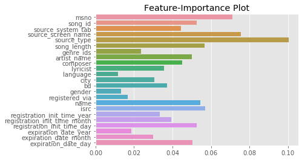

# Machine Learning Engineer Nanodegree
## Capstone Project
Joe Udacity  
December 31st, 2050

## I. Definition

### Project Overview
The commercialisation of the Internet and its entry into daily life along with the switch from analog to digital and the invention of the personal computer were the beginnings of the digital and technological changes that are now seen particularly within the music industry in the 21st century.  
Few years ago, it was inconceivable that a person would listen to the Various Artists of choice on their morning commute. But, the glory days of Radio DJs have passed, and musical gatekeepers have been replaced with Machine Learning algorithms, continously finding and curating new tracks and unlimited streaming services.  
While an OTT music subscriber has access to all kinds of music, algorithms still struggle in some areas. Without enough data about listening patter of the user, how would an algorithm know if the listener will like a new song or a new artist And, how would it know what songs to recommend to a new user. 
Music being an 18 Billion Dollars industry, is growing as more free subscribers are converting to a paid user for the convenience of auto music curation.  

### Problem Statement
In this regard; at the 11th ACM International Conference on Web Search and Data Mining ([WSDM 2018](http://www.wsdm-conference.org/2018/)) presented a [Kaggle Challenge](https://www.kaggle.com/c/kkbox-music-recommendation-challenge/overview) to build a better music recommendation system using a donated dataset from [KKBOX](https://www.kkbox.com/), Asia’s leading music streaming service, holding the world’s most comprehensive Asia-Pop music library with over 30 million tracks.  
[KKBOX](https://www.kkbox.com/) uses a collaborative filtering based algorithm with matrix factorization and word embedding in their recommendation system but believe new techniques could lead to better results.  
In this project, I will try to predict the chances of a user listening to a song repetitively after the first observable listening event within a time window was triggered.  
If there are recurring listening event(s) triggered within a month after the user’s very first observable listening event, its target is marked 1, and 0 otherwise in the training set. The same rule applies to the testing set.  

### Metrics
I would be using [Accuracy_Score](https://scikit-learn.org/stable/modules/generated/sklearn.metrics.accuracy_score.html) which is part of SciKit Library to measure the performance of the model. As mentioned in the [SCIKIT knowledge base](https://scikit-learn.org/stable/modules/model_evaluation.html#accuracy-score), accuracy score can be used in multi-label or single-label classification. Our case is single label classification problem i.e. target value, which indicates the probability of replaying the song.

  

--- 
references:
- http://www.wsdm-conference.org/2018
- https://www.kaggle.com/c/kkbox-music-recommendation-challenge/overview
- https://www.kkbox.com
- https://scikit-learn.org/stable/modules/model_evaluation.html#accuracy-score
- https://scikit-learn.org/stable/modules/generated/sklearn.metrics.accuracy_score.html
---

## II. Analysis

### Data Exploration
(categorical variables, missing values, outliers, etc.)_
The Dataset has been taken from the [WSDM - KKBox's Music Recommendation Challenge](https://www.kaggle.com/c/kkbox-music-recommendation-challenge/overview).
From [KKBOX](https://www.kkbox.com/) we have training data set consisting of information of the first observable listening event for each unique user-song pair within a specific time duration. Metadata of each unique user and song pair is also provided.  
The train and the test data are selected from users listening history in a given time period. The train and test sets are split based on time, and the split of public/private are based on unique user/song pairs. 

- train.csv
    - msno: user id
    - song_id: song id
    - source_system_tab: the name of the tab where the song was played.
    - source_screen_name: name of the layout a user sees.
    - source_type: an entry point a user first plays music on mobile apps. An entry point could be album, online-playlist, song .. etc.
    - target: this is the target variable. target=1 means there are recurring listening event(s) triggered within a month after the user’s very first observable listening event, target=0 otherwise.
- test.csv
    - id: row id
    - msno: user id
    - song_id: song id
    - source_system_tab: the name of the tab where the song was played.
    - source_screen_name: name of the layout a user sees.
    - source_type: an entry point a user first plays music on mobile apps. An entry point could be album, online-playlist, song .. etc.
- songs.csv
    - song_id
    - song_length: in ms
    - genre_ids: genre category
    - artist_name
    - composer
    - lyricist
    - language
- members.csv
    - msno
    - city
    - bd: age
    - gender
    - registered_via: registration method
    - registration_init_time: format %Y%m%d
    - expiration_date: format %Y%m%d
- song_extra_info.csv
    - song_id
    - song name - the name of the song.
    - isrc (International Standard Recording Code)

Unique Songs in Training Dataset: 359966  
Unique Songs in Testing Dataset: 224753  
Unique Users in Training Dataset: 30755  
Unique Users in Testing Dataset: 25131  
Unique Artists in Training Dataset: 40582  
Unique Artists in Testing Dataset: 27563 
Languages in the Training and Testing Dataset: 10  
Genres in Training Dataset: 572  
Genres in Training Dataset: 501   

The categorical features present in the Dataset: msno, song_id, source_system_tab, source_screen_name, source_type, genre_ids, artist_name, composer, lyricist, gender, name, isrc
Also, some features had Null values which had to be handled.

### Exploratory Visualization
The dataset shared by [KKBOX](https://www.kkbox.com/) has five files  members.csv, song_extra_info.csv, songs.csv, test.csv and train.csv. It can be seen in the notebook that the final training set is created by merging data from members.csv, song_extra_info.csv, songs.csv and train.csv. This merge operation resulted to 20 features, further breaking down the two time features (registration_init_time and expiration_date) into year, month and date, resulted to a total of 24 features after removing the two previous time features because of duplicity. To see relationship between 24 features was a big task, so I employed ensemble.RandomForestClassifier to do the Feature Importance analysis and created a PairPlot of Important Features.

  

  

Another analysis to better understand the correlation between the features is by generating a heatmap of feature correlation.

  

### Algorithms and Techniques
For solving the chosen classification problem where we want to find if a music subscriber will re-play a song within a month or not, I intend to use ensemble technique where I will first see the performance of different Models like:
- [KNeighborsClassifier](https://scikit-learn.org/stable/modules/generated/sklearn.neighbors.KNeighborsClassifier.html)
- [DecisionTreeClassifier](https://scikit-learn.org/stable/modules/generated/sklearn.tree.DecisionTreeClassifier.html)
- [RandomForestClassifier](https://scikit-learn.org/stable/modules/generated/sklearn.ensemble.RandomForestClassifier.html)
- [AdaBoostClassifier](https://scikit-learn.org/stable/modules/generated/sklearn.ensemble.AdaBoostClassifier.html)
- [GradientBoostingClassifier](https://scikit-learn.org/stable/modules/generated/sklearn.ensemble.GradientBoostingClassifier.html)
- [GaussianNB](https://scikit-learn.org/stable/modules/generated/sklearn.naive_bayes.GaussianNB.html)
- [LinearDiscriminantAnalysis](https://scikit-learn.org/stable/modules/generated/sklearn.discriminant_analysis.LinearDiscriminantAnalysis.html) and
- [QuadraticDiscriminantAnalysis](https://scikit-learn.org/stable/modules/generated/sklearn.discriminant_analysis.QuadraticDiscriminantAnalysis.html) 

Then finally using [StackingCVClassifier](http://rasbt.github.io/mlxtend/user_guide/classifier/StackingCVClassifier) technique to stack few selected classifiers to get better results. The resulting ensemble model will serve as my Benchmark model.
For the final solution I intend to use the better performing model among [LightGBM](https://lightgbm.readthedocs.io/en/latest/) and [XGBOOST](https://xgboost.readthedocs.io/en/latest/).

### Benchmark
As mentioned above, I choose to use [StackingCVClassifier](http://rasbt.github.io/mlxtend/user_guide/classifier/StackingCVClassifier/) to stack basic models which perform better on the dataset.
From the analysis done, which can be accessed in the accompanying Jupyter notebook, its seen that [GradientBoostingClassifier](https://scikit-learn.org/stable/modules/generated/sklearn.ensemble.GradientBoostingClassifier.html) and [RandomForestClassifier](https://scikit-learn.org/stable/modules/generated/sklearn.ensemble.RandomForestClassifier.html) perform better than the other listed models. The two models gave an accuracy of 0.72 and 0.74 respectively when trained on the data.

--- 
references:
- https://scikit-learn.org/stable/modules/generated/sklearn.neighbors.KNeighborsClassifier.html
- https://scikit-learn.org/stable/modules/generated/sklearn.tree.DecisionTreeClassifier.html
- https://scikit-learn.org/stable/modules/generated/sklearn.ensemble.RandomForestClassifier.html
- https://scikit-learn.org/stable/modules/generated/sklearn.ensemble.AdaBoostClassifier.html
- https://scikit-learn.org/stable/modules/generated/sklearn.ensemble.GradientBoostingClassifier.html
- https://scikit-learn.org/stable/modules/generated/sklearn.naive_bayes.GaussianNB.html
- https://scikit-learn.org/stable/modules/generated/sklearn.discriminant_analysis.LinearDiscriminantAnalysis.html
- https://scikit-learn.org/stable/modules/generated/sklearn.discriminant_analysis.QuadraticDiscriminantAnalysis.html
- http://rasbt.github.io/mlxtend/user_guide/classifier/StackingCVClassifier
- https://lightgbm.readthedocs.io/en/latest
- https://xgboost.readthedocs.io/en/latest/
---

## III. Methodology
_(approx. 3-5 pages)_

### Data Preprocessing
In this section, all of your preprocessing steps will need to be clearly documented, if any were necessary. From the previous section, any of the abnormalities or characteristics that you identified about the dataset will be addressed and corrected here. Questions to ask yourself when writing this section:
- _If the algorithms chosen require preprocessing steps like feature selection or feature transformations, have they been properly documented?_
- _Based on the **Data Exploration** section, if there were abnormalities or characteristics that needed to be addressed, have they been properly corrected?_
- _If no preprocessing is needed, has it been made clear why?_

### Implementation
In this section, the process for which metrics, algorithms, and techniques that you implemented for the given data will need to be clearly documented. It should be abundantly clear how the implementation was carried out, and discussion should be made regarding any complications that occurred during this process. Questions to ask yourself when writing this section:
- _Is it made clear how the algorithms and techniques were implemented with the given datasets or input data?_
- _Were there any complications with the original metrics or techniques that required changing prior to acquiring a solution?_
- _Was there any part of the coding process (e.g., writing complicated functions) that should be documented?_

### Refinement
In this section, you will need to discuss the process of improvement you made upon the algorithms and techniques you used in your implementation. For example, adjusting parameters for certain models to acquire improved solutions would fall under the refinement category. Your initial and final solutions should be reported, as well as any significant intermediate results as necessary. Questions to ask yourself when writing this section:
- _Has an initial solution been found and clearly reported?_
- _Is the process of improvement clearly documented, such as what techniques were used?_
- _Are intermediate and final solutions clearly reported as the process is improved?_

## IV. Results
_(approx. 2-3 pages)_

### Model Evaluation and Validation
In this section, the final model and any supporting qualities should be evaluated in detail. It should be clear how the final model was derived and why this model was chosen. In addition, some type of analysis should be used to validate the robustness of this model and its solution, such as manipulating the input data or environment to see how the model’s solution is affected (this is called sensitivity analysis). Questions to ask yourself when writing this section:
- _Is the final model reasonable and aligning with solution expectations? Are the final parameters of the model appropriate?_
- _Has the final model been tested with various inputs to evaluate whether the model generalizes well to unseen data?_
- _Is the model robust enough for the problem? Do small perturbations (changes) in training data or the input space greatly affect the results?_
- _Can results found from the model be trusted?_

### Justification
In this section, your model’s final solution and its results should be compared to the benchmark you established earlier in the project using some type of statistical analysis. You should also justify whether these results and the solution are significant enough to have solved the problem posed in the project. Questions to ask yourself when writing this section:
- _Are the final results found stronger than the benchmark result reported earlier?_
- _Have you thoroughly analyzed and discussed the final solution?_
- _Is the final solution significant enough to have solved the problem?_

## V. Conclusion
_(approx. 1-2 pages)_

### Free-Form Visualization
In this section, you will need to provide some form of visualization that emphasizes an important quality about the project. It is much more free-form, but should reasonably support a significant result or characteristic about the problem that you want to discuss. Questions to ask yourself when writing this section:
- _Have you visualized a relevant or important quality about the problem, dataset, input data, or results?_
- _Is the visualization thoroughly analyzed and discussed?_
- _If a plot is provided, are the axes, title, and datum clearly defined?_

### Reflection
In this section, you will summarize the entire end-to-end problem solution and discuss one or two particular aspects of the project you found interesting or difficult. You are expected to reflect on the project as a whole to show that you have a firm understanding of the entire process employed in your work. Questions to ask yourself when writing this section:
- _Have you thoroughly summarized the entire process you used for this project?_
- _Were there any interesting aspects of the project?_
- _Were there any difficult aspects of the project?_
- _Does the final model and solution fit your expectations for the problem, and should it be used in a general setting to solve these types of problems?_

### Improvement
In this section, you will need to provide discussion as to how one aspect of the implementation you designed could be improved. As an example, consider ways your implementation can be made more general, and what would need to be modified. You do not need to make this improvement, but the potential solutions resulting from these changes are considered and compared/contrasted to your current solution. Questions to ask yourself when writing this section:
- _Are there further improvements that could be made on the algorithms or techniques you used in this project?_
- _Were there algorithms or techniques you researched that you did not know how to implement, but would consider using if you knew how?_
- _If you used your final solution as the new benchmark, do you think an even better solution exists?_

-----------

**Before submitting, ask yourself. . .**

- Does the project report you’ve written follow a well-organized structure similar to that of the project template?
- Is each section (particularly **Analysis** and **Methodology**) written in a clear, concise and specific fashion? Are there any ambiguous terms or phrases that need clarification?
- Would the intended audience of your project be able to understand your analysis, methods, and results?
- Have you properly proof-read your project report to assure there are minimal grammatical and spelling mistakes?
- Are all the resources used for this project correctly cited and referenced?
- Is the code that implements your solution easily readable and properly commented?
- Does the code execute without error and produce results similar to those reported?
