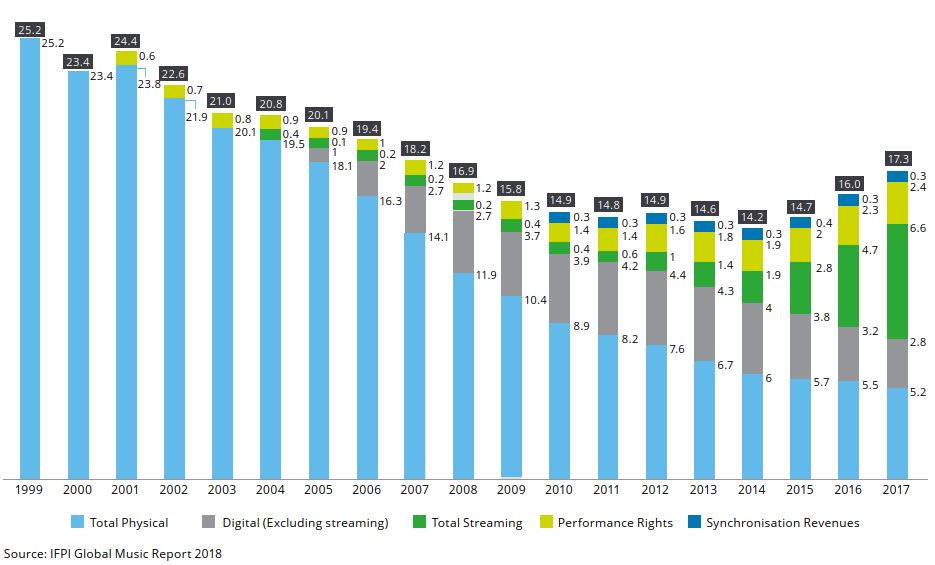
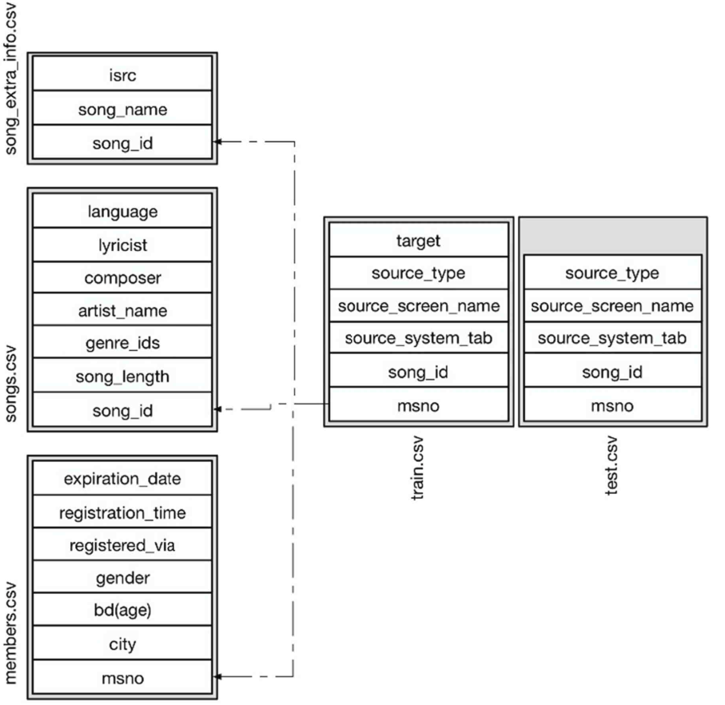
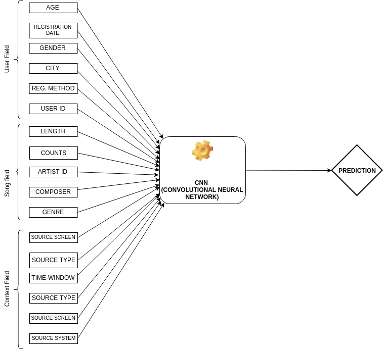

# Machine Learning Engineer Nanodegree
## Capstone Proposal
Manish Kumar  
August 11th, 2019

## Music Recommendation System

### Domain Background
The commercialisation of the Internet and its entry into daily life along with the switch from analog to digital and the invention of the personal computer were the beginnings of the digital and technological changes that are now seen particularly within the music industry in the 21st century.  
Few years ago, it was inconceivable that a person would listen to the Various Artists of choice on their morning commute. But, the glory days of Radio DJs have passed, and musical gatekeepers have been replaced with Machine Learning algorithms, continously finding and curating new tracks and unlimited streaming services.  
While an OTT music subscriber has access to all kinds of music, algorithms still struggle in some areas. Without enough data about listening patter of the user, how would an algorithm know if the listener will like a new song or a new artist And, how would it know what songs to recommend to a new user. 
Music being an 18 Billion Dollars industry, is growing as more free subscribers are converting to a paid user for the convenience of auto music curation.  
  
>The same phenomenon is repeating globally in developing countries like India and I think using the available data and the techniques learned in the Nano Degree Program, this problem can be solved.

### Problem Statement
In this regard; at the 11th ACM International Conference on Web Search and Data Mining ([WSDM 2018](http://www.wsdm-conference.org/2018/)) presented a [Kaggle Challenge](https://www.kaggle.com/c/kkbox-music-recommendation-challenge/overview) to build a better music recommendation system using a donated dataset from [KKBOX](https://www.kkbox.com/), Asia’s leading music streaming service, holding the world’s most comprehensive Asia-Pop music library with over 30 million tracks.  
[KKBOX](https://www.kkbox.com/) uses a collaborative filtering based algorithm with matrix factorization and word embedding in their recommendation system but believe new techniques could lead to better results.  
In this project, I will try to predict the chances of a user listening to a song repetitively after the first observable listening event within a time window was triggered.  
If there are recurring listening event(s) triggered within a month after the user’s very first observable listening event, its target is marked 1, and 0 otherwise in the training set. The same rule applies to the testing set.  

### Datasets and Inputs
From [KKBOX](https://www.kkbox.com/) we have training data set consisting of information of the first observable listening event for each unique user-song pair within a specific time duration. Metadata of each unique user and song pair is also provided.  
The train and the test data are selected from users listening history in a given time period. The train and test sets are split based on time, and the split of public/private are based on unique user/song pairs.   

- train.csv
    - msno: user id
    - song_id: song id
    - source_system_tab: the name of the tab where the event was triggered. System tabs are used to categorize KKBOX mobile apps functions. For example, tab my library contains functions to manipulate the local storage, and tab search contains functions relating to search.
    - source_screen_name: name of the layout a user sees.
    - source_type: an entry point a user first plays music on mobile apps. An entry point could be album, online-playlist, song .. etc.
    - target: this is the target variable. target=1 means there are recurring listening event(s) triggered within a month after the user’s very first observable listening event, target=0 otherwise.
- test.csv
    - id: row id (will be used for submission)
    - msno: user id
    - song_id: song id
    - source_system_tab: the name of the tab where the event was triggered. System tabs are used to categorize KKBOX mobile apps functions. For example, tab my library contains functions to manipulate the local storage, and tab search contains functions relating to search.
    - source_screen_name: name of the layout a user sees.
    - source_type: an entry point a user first plays music on mobile apps. An entry point could be album, online-playlist, song .. etc.
- songs.csv (Note that data is in unicode.)
    - song_id
    - song_length: in ms
    - genre_ids: genre category. Some songs have multiple genres and they are separated by "|"
    - artist_name
    - composer
    - lyricist
    - language
- members.csv (user information.)
    - msno
    - city
    - bd: age (Note: this column has outlier values)
    - gender
    - registered_via: registration method
    - registration_init_time: format %Y%m%d
    - expiration_date: format %Y%m%d
- song_extra_info.csv
    - song_id
    - song name - the name of the song.
    - isrc - International Standard Recording Code (can be used as an identity of a song)

Number of Unique Songs in Training Dataset: 359966  
Number of Unique Songs in Testing Dataset: 224753  

Number of Unique Users in Training Dataset: 30755  
Number of Unique Users in Testing Dataset: 25131  

Number of Unique Artists in Training Dataset: 40582  
Number of Unique Artists in Testing Dataset: 27563 
 
Number of Languages in the Training and Testing Dataset: 10  
Number of Genres in Training Dataset: 572  
Number of Genres in Training Dataset: 501   

The Dataset has been taken from the [WSDM - KKBox's Music Recommendation Challenge](https://www.kaggle.com/c/kkbox-music-recommendation-challenge/overview) 

### Solution Statement
First I would be trying various Ensemble methods learnt in Machine Learning Foundation Class like Gradient Boosting Algorithms like ADABoost then experimenting with Gradient Boosting Algorithms like XGBOOST, best performing model among these would be my benchmarking Models.
Following the above analysis, I would employ the Deep Learning Techniques learnt as part of the Advanced Machine Learning to see the performance of prediction, from my intuition; I feel that if the model architecture is done properly it would be able to beat the benchmarking models with by more than 15% accuracy.

### Benchmark Model
As per the Solution Statement, the better performing Ensemble methods will become my Benchmark Model. I will obtain results through an ensemble of gradient boosting tree models with different parameters. Some preprocessing will also be applied to the features described in the previous section by filling missing values and using LabelEncoder to map string variables to numeric ones. For the missing values in categorical features, I will be creating a new category “others” and for numeric features by “-1”. Since missing values are rarely missing at random, it is preferable to avoid filling in missing values by mean, median or most frequent categorical variable because we are using tree-based method. One-hot encoding for categorical features and normalization for the numeric features do not help improving tree-based method.  
Target value "1" in the training set means that the user listened to that song again within one month after the user’s very first listening. However, target value "0" in the training set means the user listened to that song again but not within one month. While training the model, I will eliminate from the training set the duplicate user-song pairs with target variable "0".  
Features: I will also try to employ Feature Engineering methods to derive and evaluate meaningful features like, Registration and Expiration date of the user, age of the use(checking out outliers), Songs Language, Age-Gap between Song and User, etc.
 
### Evaluation Metrics
The benchmark model and solution model will both be evaluated on area under the ROC curve between the predicted probability and the observed target.  

### Project Design
For this project I would be using Python 3.7.3 for development.
The Feature relationship in the project:
<!--    -->
 

#### Benchmark Project
For the benchmark project, I would be using numpy and pandas libraries for Data Loading, Data Merging, Finding additional Features (Contextual Features, User-side Features, Song-side Features and User-Song Pair) then doing some Features Processing where I would be doing Important Feature Selection. After the Data is ready, I would be using xgboost and lightgbm to get to the benchmark model AUC values.
Hyper Parameters which I will choose for LGB:
- boosting_type : gbdt
- objective : 'binary',
- metric : ['binary_logloss', 'auc'], 
- learning_rate : 0.5
- num_leaves : 99
- max_depth : 10
- min_data_in_leaf : 1306
- feature_fraction : 0.5
- bagging_fraction : 0.9
- bagging_freq : 1
- lambda_l1 : 6.37
- lambda_l2 : 65200
- min_gain_to_split : 0
- min_sum_hessian_in_leaf : 0.1  

#### Solution Project
As per my decision to use Deep Learning technique to beat the benchmark model, I would be using sklearn, keras and TensorFlow libraries from Python and a refined NN Architecture, keeping in mind the Features and extracted additional Features. Not accurately but the rough design of my NN would look like: 
<!--    -->
 
-----------
