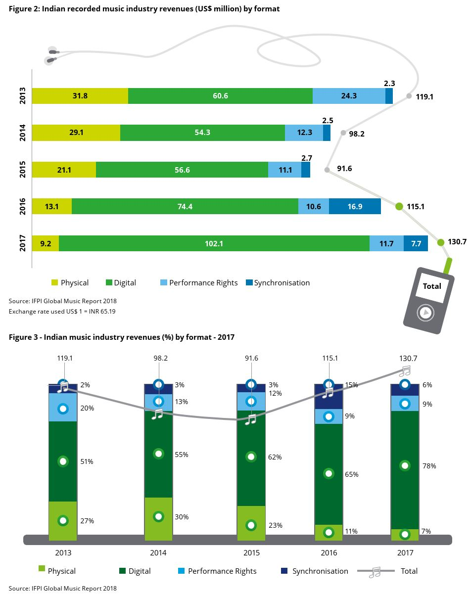

# Machine Learning Engineer Nanodegree
## Capstone Proposal
Manish Kumar 
August 6th, 2019

## Music Recommendation System

### Domain Background
The commercialisation of the Internet and its entry into daily life along with the switch from analog to digital and the invention of the personal computer were the beginnings of the digital and technological changes that are now seen particularly within the music industry in the 21st century.  
Few years ago, it was inconceivable that a person would listen to the Various Artists of choice on their morning commute. But, the glory days of Radio DJs have passed, and musical gatekeepers have been replaced with Machine Learning algorithms, continously finding and curating new tracks and unlimited streaming services.  
While an OTT music subscriber has access to all kinds of music, algorithms still struggle in some areas. Without enough data about listening patter of the user, how would an algorithm know if the listener will like a new song or a new artist And, how would it know what songs to recommend to a new user. 
Music being an 18 Billion Dollars industry, is growing as more free subscribers are converting to a paid user for the convenience of auto music curation.  
  
>The same phenomenon is repeating globally in developing countries like India and I think using the available data and the techniques learned in the Nano Degree Program, this problem can be solved.

### Problem Statement
In this regard; at the 11th ACM International Conference on Web Search and Data Mining ([WSDM 2018](http://www.wsdm-conference.org/2018/)) presented a [Kaggle Challenge](https://www.kaggle.com/c/kkbox-music-recommendation-challenge/overview) to build a better music recommendation system using a donated dataset from [KKBOX](https://www.kkbox.com/), Asia’s leading music streaming service, holding the world’s most comprehensive Asia-Pop music library with over 30 million tracks.  
[KKBOX](https://www.kkbox.com/) uses a collaborative filtering based algorithm with matrix factorization and word embedding in their recommendation system but believe new techniques could lead to better results.  
In this project, I will try to predict the chances of a user listening to a song repetitively after the first observable listening event within a time window was triggered.  
If there are recurring listening event(s) triggered within a month after the user’s very first observable listening event, its target is marked 1, and 0 otherwise in the training set. The same rule applies to the testing set.  

### Datasets and Inputs

From [KKBOX](https://www.kkbox.com/) we have training data set consisting of information of the first observable listening event for each unique user-song pair within a specific time duration. Metadata of each unique user and song pair is also provided.  
The train and the test data are selected from users listening history in a given time period. The train and test sets are split based on time, and the split of public/private are based on unique user/song pairs.   

- train.csv
    - msno: user id
    - song_id: song id
    - source_system_tab: the name of the tab where the event was triggered. System tabs are used to categorize KKBOX mobile apps functions. For example, tab my library contains functions to manipulate the local storage, and tab search contains functions relating to search.
    - source_screen_name: name of the layout a user sees.
    - source_type: an entry point a user first plays music on mobile apps. An entry point could be album, online-playlist, song .. etc.
    - target: this is the target variable. target=1 means there are recurring listening event(s) triggered within a month after the user’s very first observable listening event, target=0 otherwise.
- test.csv
    - id: row id (will be used for submission)
    - msno: user id
    - song_id: song id
    - source_system_tab: the name of the tab where the event was triggered. System tabs are used to categorize KKBOX mobile apps functions. For example, tab my library contains functions to manipulate the local storage, and tab search contains functions relating to search.
    - source_screen_name: name of the layout a user sees.
    - source_type: an entry point a user first plays music on mobile apps. An entry point could be album, online-playlist, song .. etc.
- sample_submission.csv
    - id: same as id in test.csv
    - target: this is the target variable. target=1 means there are recurring listening event(s) triggered within a month after the user’s very first observable listening event, target=0 otherwise .
- songs.csv (Note that data is in unicode.)
    - song_id
    - song_length: in ms
    - genre_ids: genre category. Some songs have multiple genres and they are separated by "|"
    - artist_name
    - composer
    - lyricist
    - language
- members.csv (user information.)
    - msno
    - city
    - bd: age (Note: this column has outlier values)
    - gender
    - registered_via: registration method
    - registration_init_time: format %Y%m%d
    - expiration_date: format %Y%m%d
- song_extra_info.csv
    - song_id
    - song name - the name of the song.
    - isrc - International Standard Recording Code (can be used as an identity of a song)

Number of Unique Songs in Training Dataset: 359966  
Number of Unique Songs in Testing Dataset: 224753  

Number of Unique Users in Training Dataset: 30755  
Number of Unique Users in Testing Dataset: 25131  

Number of Unique Artists in Training Dataset: 40582  
Number of Unique Artists in Testing Dataset: 27563

Number of Languages in the Training and Testing Dataset: 10  
Number of Genres in Training Dataset: 572  
Number of Genres in Training Dataset: 501  

The Dataset has been taken from the [WSDM - KKBox's Music Recommendation Challenge](https://www.kaggle.com/c/kkbox-music-recommendation-challenge/overview) 

### Solution Statement
_(approx. 1 paragraph)_

In this section, clearly describe a solution to the problem. The solution should be applicable to the project domain and appropriate for the dataset(s) or input(s) given. Additionally, describe the solution thoroughly such that it is clear that the solution is quantifiable (the solution can be expressed in mathematical or logical terms) , measurable (the solution can be measured by some metric and clearly observed), and replicable (the solution can be reproduced and occurs more than once).

### Benchmark Model
_(approximately 1-2 paragraphs)_

In this section, provide the details for a benchmark model or result that relates to the domain, problem statement, and intended solution. Ideally, the benchmark model or result contextualizes existing methods or known information in the domain and problem given, which could then be objectively compared to the solution. Describe how the benchmark model or result is measurable (can be measured by some metric and clearly observed) with thorough detail.

### Evaluation Metrics
_(approx. 1-2 paragraphs)_

In this section, propose at least one evaluation metric that can be used to quantify the performance of both the benchmark model and the solution model. The evaluation metric(s) you propose should be appropriate given the context of the data, the problem statement, and the intended solution. Describe how the evaluation metric(s) are derived and provide an example of their mathematical representations (if applicable). Complex evaluation metrics should be clearly defined and quantifiable (can be expressed in mathematical or logical terms).

### Project Design
_(approx. 1 page)_

In this final section, summarize a theoretical workflow for approaching a solution given the problem. Provide thorough discussion for what strategies you may consider employing, what analysis of the data might be required before being used, or which algorithms will be considered for your implementation. The workflow and discussion that you provide should align with the qualities of the previous sections. Additionally, you are encouraged to include small visualizations, pseudocode, or diagrams to aid in describing the project design, but it is not required. The discussion should clearly outline your intended workflow of the capstone project.

-----------

**Before submitting your proposal, ask yourself. . .**

- Does the proposal you have written follow a well-organized structure similar to that of the project template?
- Is each section (particularly **Solution Statement** and **Project Design**) written in a clear, concise and specific fashion? Are there any ambiguous terms or phrases that need clarification?
- Would the intended audience of your project be able to understand your proposal?
- Have you properly proofread your proposal to assure there are minimal grammatical and spelling mistakes?
- Are all the resources used for this project correctly cited and referenced?
